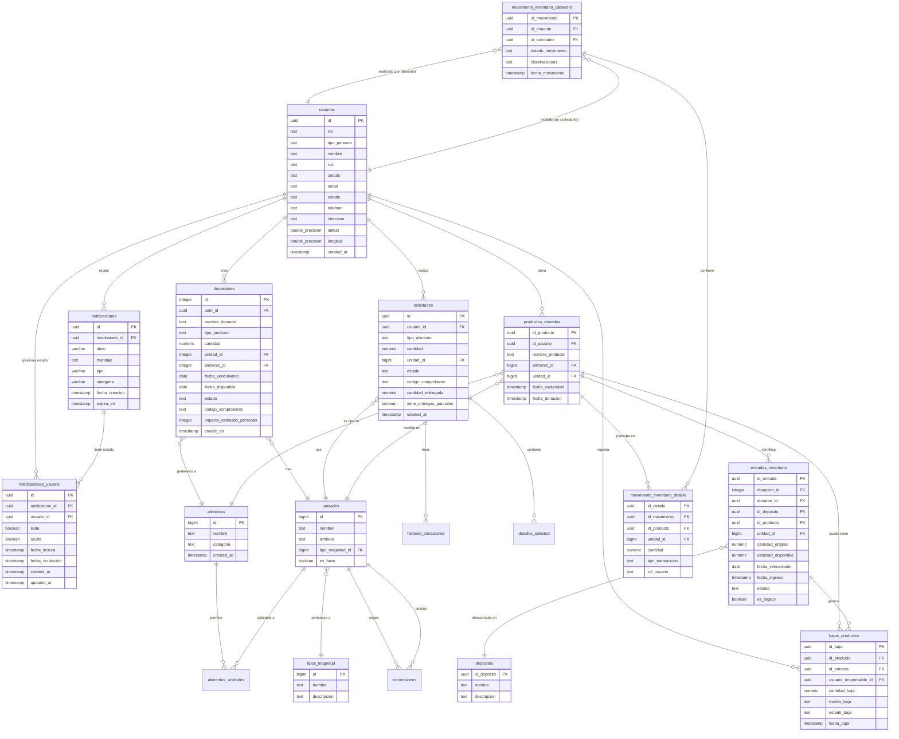

# 🗄️ Base de Datos - Banco de Alimentos ULEAM

## Índice
- [Visión General](#visión-general)
- [Diagrama Entidad-Relación](#diagrama-entidad-relación)
- [Tablas Principales](#tablas-principales)
- [Diccionario de Datos](#diccionario-de-datos)
- [Relaciones y Cardinalidad](#relaciones-y-cardinalidad)
- [Funciones y Triggers](#funciones-y-triggers)
- [Row Level Security (RLS)](#row-level-security-rls)
- [Vistas Materializadas](#vistas-materializadas)
- [Índices y Optimización](#índices-y-optimización)

---

## Visión General

El sistema utiliza **PostgreSQL** como motor de base de datos, gestionado a través de **Supabase**. La base de datos está diseñada con los siguientes principios:

### Características Principales:

- ✅ **Normalización 3NF**: Evita redundancia de datos
- ✅ **Integridad Referencial**: Foreign keys en todas las relaciones
- ✅ **Row Level Security (RLS)**: Seguridad a nivel de fila
- ✅ **Triggers Automáticos**: Automatización de lógica de negocio
- ✅ **Funciones Almacenadas**: Lógica compleja en la BD
- ✅ **Vistas**: Consultas complejas simplificadas
- ✅ **Índices Optimizados**: Para queries frecuentes

### Tecnologías:

- **PostgreSQL**: Motor de base de datos
- **Supabase**: Backend-as-a-Service
- **UUID**: Para claves primarias
- **JSONB**: Para metadatos flexibles
- **Extensions**: pgcrypto, uuid-ossp, pg_stat_statements, supabase_vault

## Migraciones y Arranque Desde Cero

La fuente oficial para crear una base nueva es `supabase/migrations/`.
Los archivos se ejecutan en orden ascendente por nombre e incluyen:

- Esquema completo, funciones, triggers, vistas, constraints e índices.
- RLS y grants endurecidos para `anon`, `authenticated` y `service_role`.
- Seed de catálogo base: tipos de magnitud, unidades, conversiones, alimentos, relaciones alimento-unidad y depósitos iniciales.
- Flujo de solicitudes de alta de alimentos y hardening final detectado con Supabase MCP Advisor.

`supabase/migrations/` es la única fuente SQL versionada para instalaciones
nuevas y actualizaciones de la base de datos.

### Modelo vigente de inventario

`entradas_inventario` es la única fuente de stock. Cada fila representa una
entrada/lote independiente, conserva `donacion_id`, depósito, unidad,
vencimiento y cantidades original/disponible. Las consultas y operaciones usan
`id_entrada`, suman las entradas disponibles y aplican FEFO por entrada.

`productos_donados` conserva únicamente la identidad y el catálogo del
producto, con `unidad_id` como referencia a `unidades`; no almacena saldo.
La tabla agregada `inventario`, `productos_donados.cantidad` y
`productos_donados.unidad_medida` se retiran en la migración
`20260724220103_consolidate_entries_inventory_source.sql`. Las migraciones
anteriores se conservan como historial y no representan el contrato vigente.

La preferencia `usuarios.recibir_notificaciones` continúa activa para el correo
global. `notificaciones_usuario` conserva lectura y ocultamiento por usuario.

---

## Diagrama Entidad-Relación



---

## Tablas Principales

### 👥 usuarios

**Propósito**: Gestión de perfiles de usuarios del sistema

| Columna | Tipo | Descripción | Restricciones |
|---------|------|-------------|---------------|
| id | uuid | Identificador único (FK a auth.users) | PK, NOT NULL |
| email | text | Email del usuario | |
| rol | text | Rol del usuario | CHECK: ADMINISTRADOR, DONANTE, SOLICITANTE, OPERADOR |
| tipo_persona | text | Tipo de persona | Natural o Jurídica |
| nombre | text | Nombre completo o razón social | |
| cedula | text | Cédula de identidad | UNIQUE (si no null) |
| ruc | text | RUC (personas jurídicas) | |
| telefono | text | Teléfono de contacto | |
| direccion | text | Dirección física | |
| latitud | double precision | Coordenada geográfica | |
| longitud | double precision | Coordenada geográfica | |
| estado | varchar(20) | Estado de la cuenta | CHECK: activo, bloqueado, desactivado |
| recibir_notificaciones | boolean | Preferencia de notificaciones | DEFAULT true |
| fecha_fin_bloqueo | timestamp | Fin de bloqueo temporal | |
| motivo_bloqueo | text | Razón del bloqueo | |
| created_at | timestamp | Fecha de creación | DEFAULT now() |
| updated_at | timestamp | Última actualización | DEFAULT now() |

**Índices**:
- `idx_usuarios_estado` en `estado`
- `unique_cedula_idx` en `cedula` (único si no nulo)

---

### 🎁 donaciones

**Propósito**: Registro de donaciones de alimentos

| Columna | Tipo | Descripción | Restricciones |
|---------|------|-------------|---------------|
| id | integer | Identificador único | PK, SERIAL |
| user_id | uuid | ID del donante | FK a usuarios |
| nombre_donante | text | Nombre del donante | NOT NULL |
| ruc_donante | text | RUC (si aplica) | |
| cedula_donante | text | Cédula (si aplica) | |
| tipo_persona_donante | text | Natural o Jurídica | |
| alimento_id | integer | ID del alimento | FK a alimentos |
| tipo_producto | text | Nombre del producto | NOT NULL |
| categoria_comida | text | Categoría del alimento | NOT NULL |
| es_producto_personalizado | boolean | Si es producto custom | DEFAULT false |
| cantidad | numeric(10,2) | Cantidad donada | CHECK > 0 |
| unidad_id | integer | Unidad de medida | FK a unidades, NOT NULL |
| unidad_nombre | text | Nombre de la unidad | |
| unidad_simbolo | text | Símbolo de la unidad | |
| fecha_vencimiento | date | Fecha de caducidad | |
| fecha_disponible | date | Disponible para recoger | NOT NULL |
| direccion_entrega | text | Dirección de recogida | NOT NULL |
| horario_preferido | text | Horario preferido | |
| observaciones | text | Comentarios adicionales | |
| impacto_estimado_personas | integer | Personas alimentadas | |
| impacto_equivalente | text | Equivalente en comidas | |
| estado | text | Estado de la donación | CHECK: Pendiente, Recogida, Entregada, Cancelada |
| codigo_comprobante | text | Código único del comprobante (generado por la capa de aplicación) | |
| motivo_cancelacion | text | Razón de cancelación | CHECK: error_donante, no_disponible, etc. |
| observaciones_cancelacion | text | Detalles de cancelación | |
| usuario_cancelacion_id | uuid | Quien canceló | FK a auth.users |
| fecha_cancelacion | timestamp | Cuándo se canceló | |
| creado_en | timestamp | Fecha de creación | DEFAULT now() |
| actualizado_en | timestamp | Última actualización | DEFAULT now() |

**Índices**:
- `idx_donaciones_user_id` en `user_id`
- `idx_donaciones_estado` en `estado`
- `idx_donaciones_alimento_id` en `alimento_id`
- `idx_donaciones_unidad_id` en `unidad_id`
- `idx_donaciones_codigo_comprobante` en `codigo_comprobante`

**Triggers**:
- `trigger_crear_producto`: Crea producto en inventario cuando estado = 'Aprobada'
- Las notificaciones de estado se generan desde la capa de aplicación mediante `/api/notificaciones` y eventos controlados.

---

### 📋 solicitudes

**Propósito**: Solicitudes de alimentos por beneficiarios

| Columna | Tipo | Descripción | Restricciones |
|---------|------|-------------|---------------|
| id | uuid | Identificador único | PK, DEFAULT gen_random_uuid() |
| usuario_id | uuid | ID del solicitante | FK a usuarios, NOT NULL |
| tipo_alimento | text | Tipo de alimento solicitado | NOT NULL |
| cantidad | numeric | Cantidad solicitada | NOT NULL |
| unidad_id | bigint | Unidad de medida | FK a unidades |
| comentarios | text | Comentarios adicionales | |
| latitud | double precision | Coordenada de entrega | |
| longitud | double precision | Coordenada de entrega | |
| estado | text | Estado de la solicitud | CHECK: pendiente, aprobada, rechazada, entregada |
| codigo_comprobante | text | Código del comprobante (generado por la capa de aplicación) | |
| cantidad_entregada | numeric(10,2) | Cantidad ya entregada | DEFAULT 0 |
| tiene_entregas_parciales | boolean | Si tiene entregas parciales | DEFAULT false |
| fecha_respuesta | timestamp | Cuándo se respondió | |
| comentario_admin | text | Comentario del operador | |
| motivo_rechazo | text | Razón del rechazo | |
| operador_rechazo_id | uuid | Quien rechazó | FK a usuarios |
| fecha_rechazo | timestamp | Cuándo se rechazó | |
| operador_aprobacion_id | uuid | Quien aprobó | FK a usuarios |
| fecha_aprobacion | timestamp | Cuándo se aprobó | |
| created_at | timestamp | Fecha de creación | DEFAULT now() |

**Índices**:
- `idx_solicitudes_id_usuario` en `usuario_id`
- `idx_solicitudes_estado_fecha_respuesta` en `estado, fecha_respuesta`
- `idx_solicitudes_unidad_id` en `unidad_id`
- `idx_solicitudes_codigo_comprobante` en `codigo_comprobante`

**Notificaciones**:
- Los cambios de estado relevantes disparan `/api/notificaciones` desde la capa de aplicación con eventos controlados.

---

### 📦 productos_donados

**Propósito**: Catálogo e identidad de los productos donados. No representa
stock ni acumula cantidades.

| Columna | Tipo | Descripción | Restricciones |
|---------|------|-------------|---------------|
| id_producto | uuid | Identificador único | PK, DEFAULT gen_random_uuid() |
| id_usuario | uuid | ID del donante original | FK a usuarios |
| nombre_producto | text | Nombre del producto | |
| descripcion | text | Descripción del producto | |
| alimento_id | bigint | Tipo de alimento | FK a alimentos |
| unidad_id | bigint | Unidad de medida | FK a unidades |
| fecha_donacion | timestamp | Cuándo se donó | DEFAULT now() |

**Índices**:
- `idx_productos_id_usuario` en `id_usuario`
- `idx_productos_donados_alimento_id` en `alimento_id`
- `idx_productos_donados_unidad` en `unidad_id`
- `idx_productos_nombre_unidad` UNIQUE en `lower(trim(nombre_producto)), unidad_id`

**Constraint Único**:
- Previene duplicados de productos con mismo nombre (normalizado) y unidad

---

### 📦 entradas_inventario

**Propósito**: Fuente única de inventario. Cada registro es una entrada/lote
independiente, incluso cuando varias donaciones usan el mismo producto.

| Columna | Tipo | Descripción | Restricciones |
|---------|------|-------------|---------------|
| id_entrada | uuid | Identificador de la entrada/lote | PK, DEFAULT gen_random_uuid() |
| donacion_id | bigint | Donación de origen | FK a donaciones, UNIQUE cuando no es NULL |
| donante_id | uuid | Donante de origen | FK a usuarios |
| id_deposito | uuid | Depósito donde está | FK a depositos, NOT NULL |
| id_producto | uuid | Producto almacenado | FK a productos_donados, NOT NULL |
| unidad_id | bigint | Unidad de la entrada | FK a unidades |
| cantidad_original | numeric | Cantidad inicial del lote | NOT NULL |
| cantidad_disponible | numeric | Saldo actual del lote | NOT NULL, CHECK >= 0 |
| fecha_vencimiento | date | Vencimiento del lote | |
| fecha_ingreso | timestamp | Ingreso al inventario | DEFAULT now() |
| estado | text | Estado de la entrada | disponible, agotado, vencido, cancelado |
| es_legacy | boolean | Marca de datos históricos | DEFAULT false |
| updated_at | timestamp | Última actualización | DEFAULT now() |

**Índices**:
- `entradas_inventario_donacion_unica` UNIQUE en `donacion_id` cuando no es NULL
- Índices por `id_deposito`, `id_producto`, `estado` y `fecha_vencimiento`

**Regla de stock**: el disponible de un producto/deposito se calcula sumando
`cantidad_disponible` de sus entradas en estado `disponible`; nunca se lee un
saldo agregado del catálogo.

---

### 🏢 depositos

**Propósito**: Almacenes donde se guarda el inventario

| Columna | Tipo | Descripción | Restricciones |
|---------|------|-------------|---------------|
| id_deposito | uuid | Identificador único | PK, DEFAULT gen_random_uuid() |
| nombre | text | Nombre del depósito | NOT NULL |
| descripcion | text | Descripción del depósito | |

---

### 📝 movimiento_inventario_cabecera

**Propósito**: Encabezado de movimientos de inventario (trazabilidad)

| Columna | Tipo | Descripción | Restricciones |
|---------|------|-------------|---------------|
| id_movimiento | uuid | Identificador único | PK, DEFAULT gen_random_uuid() |
| fecha_movimiento | timestamp | Cuándo ocurrió | DEFAULT now() |
| id_donante | uuid | Usuario que dona/registra | FK a usuarios, NOT NULL |
| id_solicitante | uuid | Usuario que recibe | FK a usuarios, NOT NULL |
| estado_movimiento | text | Estado del movimiento | CHECK: pendiente, completado, donado |
| observaciones | text | Comentarios | |

**Índices**:
- `idx_movimiento_donante` en `id_donante`
- `idx_movimiento_solicitante` en `id_solicitante`

---

### 📄 movimiento_inventario_detalle

**Propósito**: Detalle de cada línea de movimiento

| Columna | Tipo | Descripción | Restricciones |
|---------|------|-------------|---------------|
| id_detalle | uuid | Identificador único | PK, DEFAULT gen_random_uuid() |
| id_movimiento | uuid | Movimiento al que pertenece | FK a movimiento_inventario_cabecera, NOT NULL |
| id_producto | uuid | Producto movido | FK a productos_donados, NOT NULL |
| cantidad | numeric | Cantidad movida | NOT NULL |
| unidad_id | bigint | Unidad de medida | FK a unidades |
| tipo_transaccion | text | Tipo de movimiento | CHECK: ingreso, egreso, baja |
| rol_usuario | text | Rol del responsable | CHECK: donante, beneficiario, distribuidor |
| observacion_detalle | text | Comentarios de la línea | |

**Índices**:
- `idx_detalle_movimiento` en `id_movimiento`
- `idx_detalle_producto` en `id_producto`
- `idx_movimiento_detalle_unidad` en `unidad_id`

---

### 🍎 alimentos

**Propósito**: Catálogo de alimentos permitidos

| Columna | Tipo | Descripción | Restricciones |
|---------|------|-------------|---------------|
| id | bigint | Identificador único | PK, SERIAL |
| nombre | text | Nombre del alimento | NOT NULL |
| categoria | text | Categoría del alimento | |
| created_at | timestamp | Fecha de creación | DEFAULT now() |
| updated_at | timestamp | Última actualización | DEFAULT now() |

**Índices**:
- `idx_alimentos_nombre` en `nombre`
- `idx_alimentos_categoria` en `categoria`

---

### 📏 unidades

**Propósito**: Unidades de medida del sistema

| Columna | Tipo | Descripción | Restricciones |
|---------|------|-------------|---------------|
| id | bigint | Identificador único | PK, SERIAL |
| nombre | text | Nombre de la unidad | NOT NULL |
| simbolo | text | Símbolo de la unidad | NOT NULL |
| tipo_magnitud_id | bigint | Tipo de magnitud | FK a tipos_magnitud, NOT NULL |
| es_base | boolean | Si es unidad base | DEFAULT false |
| created_at | timestamp | Fecha de creación | DEFAULT now() |

**Índices**:
- `idx_unidades_nombre` en `nombre`
- `idx_unidades_simbolo` en `simbolo`
- `idx_unidades_tipo_magnitud` en `tipo_magnitud_id`

**Ejemplos**:
- Masa: kg, g, lb, oz (base: kg)
- Volumen: L, mL, gal (base: L)
- Unidad: unidades, docenas, cajas (base: unidad)

---

### 🔄 conversiones

**Propósito**: Factores de conversión entre unidades

| Columna | Tipo | Descripción | Restricciones |
|---------|------|-------------|---------------|
| id | bigint | Identificador único | PK, SERIAL |
| unidad_origen_id | bigint | Unidad de origen | FK a unidades, NOT NULL |
| unidad_destino_id | bigint | Unidad de destino | FK a unidades, NOT NULL |
| factor_conversion | numeric(15,8) | Factor de conversión | NOT NULL |
| created_at | timestamp | Fecha de creación | DEFAULT now() |

**Constraint**:
- `conversiones_unidades_diferentes`: unidad_origen_id ≠ unidad_destino_id
- `conversiones_unicas` UNIQUE en `unidad_origen_id, unidad_destino_id`

**Ejemplo**:
```sql
-- 1 kg = 1000 g
INSERT INTO conversiones (unidad_origen_id, unidad_destino_id, factor_conversion)
VALUES (1, 2, 1000);

-- 1 L = 1000 mL
INSERT INTO conversiones (unidad_origen_id, unidad_destino_id, factor_conversion)
VALUES (5, 6, 1000);
```

---

### 🔔 notificaciones

**Propósito**: Contenido global e inmutable de las notificaciones. El estado de
lectura y ocultamiento se almacena por usuario en `notificaciones_usuario`.

| Columna | Tipo | Descripción | Restricciones |
|---------|------|-------------|---------------|
| id | uuid | Identificador único | PK, DEFAULT gen_random_uuid() |
| titulo | varchar(255) | Título de la notificación | NOT NULL |
| mensaje | text | Contenido de la notificación | NOT NULL |
| tipo | varchar(50) | Tipo de notificación | DEFAULT 'info' |
| destinatario_id | uuid | Usuario destinatario | FK a usuarios |
| rol_destinatario | varchar(50) | Rol destinatario | |
| categoria | varchar(100) | Categoría de la notificación | NOT NULL |
| url_accion | varchar(500) | URL al hacer clic | |
| metadatos | jsonb | Datos adicionales | DEFAULT '{}' |
| fecha_creacion | timestamp | Cuándo se creó | DEFAULT now() |
| expira_en | timestamp | Cuándo expira | |

**Índices**:
- `idx_notificaciones_destinatario` en `destinatario_id`
- `idx_notificaciones_rol` en `rol_destinatario`
- `idx_notificaciones_categoria` en `categoria`
- `idx_notificaciones_fecha_creacion` en `fecha_creacion DESC`

### 🔔 notificaciones_usuario

**Propósito**: Estado individual de cada notificación para cada usuario.

| Columna | Tipo | Descripción | Restricciones |
|---------|------|-------------|---------------|
| id | uuid | Identificador del estado | PK, DEFAULT gen_random_uuid() |
| notificacion_id | uuid | Notificación relacionada | FK a notificaciones, ON DELETE CASCADE |
| usuario_id | uuid | Usuario propietario del estado | FK a usuarios, ON DELETE CASCADE |
| leida | boolean | Si el usuario la leyó | DEFAULT false |
| oculta | boolean | Si el usuario la ocultó | DEFAULT false |
| fecha_lectura | timestamp | Cuándo la leyó | |
| fecha_ocultacion | timestamp | Cuándo la ocultó | |
| created_at | timestamp | Fecha de creación | DEFAULT now() |
| updated_at | timestamp | Última actualización | DEFAULT now() |

**Restricciones e índices**:
- UNIQUE en `notificacion_id, usuario_id`.
- RLS permite consultar y modificar únicamente filas del usuario autenticado.
- La visibilidad global depende de `expira_en IS NULL OR expira_en > now()`.

**Contrato de escritura**:
- El cliente no inserta notificaciones con payload libre.
- La API pública de aplicación es `POST /api/notificaciones` con `{ event, entityId }`.
- El servidor valida sesión, perfil activo, rol permitido y ownership/contexto de la entidad.
- `NotificationService` usa `SUPABASE_SERVICE_ROLE_KEY` solo en servidor para insertar la notificación, resolver destinatarios y consultar preferencias de email.

**Realtime**:
- El frontend escucha cambios de `notificaciones` por `destinatario_id`, por
  `rol_destinatario` y por `TODOS`.
- También escucha `notificaciones_usuario` filtrada por `usuario_id` para
  actualizar solo el estado del usuario actual.
- El handler deduplica por `id` porque Supabase Realtime no soporta filtros
  `OR` en una sola suscripción de Postgres Changes.
- En una base nueva, ambas tablas deben estar incluidas en la publicación
  `supabase_realtime`:

```sql
ALTER PUBLICATION supabase_realtime ADD TABLE public.notificaciones;
ALTER PUBLICATION supabase_realtime ADD TABLE public.notificaciones_usuario;
```

**RPCs del frontend**:
- `obtener_notificaciones_usuario(p_limite)` devuelve las notificaciones
  visibles con `leida` calculada desde `notificaciones_usuario`.
- `marcar_notificacion_leida(p_notificacion_id)` y
  `marcar_todas_notificaciones_leidas()` actualizan solo el estado del usuario
  autenticado.
- `ocultar_notificacion(p_notificacion_id)` oculta la notificación solo para
  el usuario actual.
- El cliente no actualiza directamente `notificaciones`.

---

### ⚠️ bajas_productos

**Propósito**: Registro de bajas de inventario

| Columna | Tipo | Descripción | Restricciones |
|---------|------|-------------|---------------|
| id_baja | uuid | Identificador único | PK, DEFAULT gen_random_uuid() |
| id_producto | uuid | Producto dado de baja | FK a productos_donados, NOT NULL |
| id_entrada | uuid | Entrada/lote afectado | FK a entradas_inventario, NOT NULL |
| id_deposito | uuid | Depósito donde estaba | FK a depositos |
| cantidad_baja | numeric | Cantidad dada de baja | CHECK > 0, NOT NULL |
| motivo_baja | text | Razón de la baja | CHECK: vencido, dañado, contaminado, rechazado, otro |
| usuario_responsable_id | uuid | Quien registró la baja | FK a usuarios, NOT NULL |
| observaciones | text | Comentarios adicionales | |
| estado_baja | text | Estado del registro | CHECK: confirmada, pendiente_revision, revisada |
| nombre_producto | text | Nombre del producto | |
| cantidad_disponible_antes | numeric | Stock antes de la baja | |
| fecha_baja | timestamp | Cuándo se registró | DEFAULT now() |
| created_at | timestamp | Fecha de creación | DEFAULT now() |
| updated_at | timestamp | Última actualización | DEFAULT now() |

**Índices**:
- `idx_bajas_productos_producto` en `id_producto`
- `idx_bajas_productos_usuario` en `usuario_responsable_id`
- `idx_bajas_productos_fecha` en `fecha_baja DESC`
- `idx_bajas_productos_motivo` en `motivo_baja`
- `idx_bajas_productos_estado` en `estado_baja`

---

## Relaciones y Cardinalidad

### Relaciones Principales:

```
usuarios (1) ──── (N) donaciones
  "Un usuario puede crear muchas donaciones"

usuarios (1) ──── (N) solicitudes
  "Un usuario puede tener muchas solicitudes"

donaciones (N) ──── (1) alimentos
  "Muchas donaciones de un tipo de alimento"

productos_donados (N) ──── (1) alimentos
  "Muchos productos de un tipo de alimento"

productos_donados (N) ──── (1) unidades
  "Muchos productos con una unidad de medida"

entradas_inventario (N) ──── (1) depositos
  "Muchas entradas/lotes en un depósito"

entradas_inventario (N) ──── (1) productos_donados
  "Muchas entradas de un producto de catálogo"

movimiento_inventario_cabecera (1) ──── (N) movimiento_inventario_detalle
  "Un movimiento tiene muchas líneas de detalle"

alimentos (N) ──── (N) unidades (a través de alimentos_unidades)
  "Muchos alimentos pueden usar muchas unidades"

unidades (N) ──── (N) unidades (a través de conversiones)
  "Una unidad puede convertirse a muchas otras"
```

---

## Funciones y Triggers

### Frontera transaccional de inventario

La responsabilidad se divide entre base de datos y capa de aplicación:

- **Donaciones**: la base de datos gobierna la creación de una entrada independiente en `entradas_inventario` mediante `trigger_crear_producto` / `crear_producto_desde_donacion()` cuando una donación pasa a estado `Aprobada`. El trigger valida la bodega almacenada en la donación y `productos_donados` solo se crea o reutiliza como identidad de catálogo.
- **Bajas de productos**: la base de datos gobierna el flujo mediante la RPC `dar_baja_producto(p_id_entrada, ...)`, que bloquea y actualiza la entrada exacta y registra la baja y el movimiento en una unidad transaccional.
- **Solicitudes aprobadas y entregas parciales**: la capa de aplicación solicita descuentos FEFO a `descontar_stock_por_lote()`. La RPC modifica directamente las entradas seleccionadas y devuelve sus `idEntrada`; si falla la actualización posterior, el servicio restaura esas entradas con `restaurar_entrada_inventario()`.
- **Historial de entregas parciales**: `historial_donaciones` se mantiene como auditoría de aplicación; un fallo al registrar historial se reporta en logs y no duplica descuentos de inventario.

Para nuevas operaciones que modifiquen más de una tabla crítica, la preferencia es una RPC SQL transaccional. Si se implementa en la capa de aplicación, debe incluir compensación explícita y tests de fallo de stock/movimiento.

### 🔧 Funciones Principales

#### 1. Notificaciones por evento

**Propósito**: Crear notificaciones sin aceptar contenido sensible desde el cliente.

El frontend llama a `/api/notificaciones` con un evento permitido:

```json
{
  "event": "catalog_food_request_created",
  "entityId": "55555555-5555-4555-8555-555555555555"
}
```

La capa de aplicación consulta la entidad, valida rol/ownership y construye internamente `titulo`, `mensaje`, `destinatario_id`, `rol_destinatario`, `url_accion`, `metadatos` y email. La tabla `notificaciones` queda como persistencia del resultado, no como contrato de negocio para clientes.

---

#### 2. `crear_producto_desde_donacion()`

**Propósito**: Crear una entrada independiente cuando una donación es aprobada.
El trigger reutiliza la identidad del producto en el catálogo, pero nunca
acumula saldo en `productos_donados`.

```sql
CREATE FUNCTION crear_producto_desde_donacion() 
RETURNS TRIGGER
SECURITY DEFINER
AS $$
DECLARE
  v_producto_id uuid;
BEGIN
  -- La implementación vigente crea una fila en entradas_inventario por donación.
  -- El detalle completo está versionado en supabase/migrations/.
  INSERT INTO entradas_inventario (
    donacion_id, id_producto, unidad_id,
    cantidad_original, cantidad_disponible, estado
  ) VALUES (
    NEW.id, v_producto_id, NEW.unidad_id,
    NEW.cantidad, NEW.cantidad, 'disponible'
  );
  RETURN NEW;
END;
$$;
```

---

#### 3. `dar_baja_producto()`

**Propósito**: Dar de baja una entrada/lote y registrar la trazabilidad en una
transacción atómica.

**Diagrama de Flujo Transaccional**:

```mermaid
sequenceDiagram
    participant App as App/API
    participant Func as FN dar_baja_producto()
    participant Inv as entradas_inventario
    participant Bajas as Tabla Bajas
    participant Movs as Tablas Movimientos
    
    App->>Func: Ejecutar (ID, Cantidad, Motivo)
    
    rect rgb(30, 30, 30)
    Note right of Func: Transacción Atómica
    Func->>Inv: Bloquear entrada por id_entrada
    
    alt Stock Insuficiente
        Func-->>App: Error (False)
    else Stock Suficiente
        Func->>Bajas: Insertar Registro Baja
        Func->>Inv: UPDATE cantidad_disponible - baja
        Func->>Movs: INSERT Cabecera Movimiento
        Func->>Movs: INSERT Detalle Movimiento
        Func-->>App: Éxito (True, ID_Baja)
    end
    end
```



**Código SQL**:

```sql
CREATE FUNCTION dar_baja_producto(
  p_id_entrada UUID,
  p_cantidad NUMERIC,
  p_motivo TEXT,
  p_usuario_id UUID,
  p_observaciones TEXT DEFAULT NULL
)
RETURNS TABLE(success BOOLEAN, message TEXT, id_baja UUID, cantidad_restante NUMERIC)
AS $$
DECLARE
  v_cantidad_actual numeric;
  v_nueva_cantidad numeric;
  v_id_baja uuid;
BEGIN
  -- Validar motivo
  IF p_motivo NOT IN ('vencido', 'dañado', 'contaminado', 'rechazado', 'otro') THEN
    RETURN QUERY SELECT false, 'Motivo inválido', NULL::uuid, NULL::numeric;
    RETURN;
  END IF;
  
  -- Obtener cantidad actual
  SELECT cantidad_disponible INTO v_cantidad_actual
  FROM entradas_inventario WHERE id_entrada = p_id_entrada;
  
  -- Verificar suficiente cantidad
  IF v_cantidad_actual < p_cantidad THEN
    RETURN QUERY SELECT false, 'Cantidad insuficiente', NULL::uuid, v_cantidad_actual;
    RETURN;
  END IF;
  
  -- Calcular nueva cantidad
  v_nueva_cantidad := v_cantidad_actual - p_cantidad;
  
  -- Registrar baja
  INSERT INTO bajas_productos (...)
  VALUES (...)
  RETURNING id_baja INTO v_id_baja;
  
  -- Actualizar la entrada exacta
  UPDATE entradas_inventario
  SET cantidad_disponible = v_nueva_cantidad
  WHERE id_entrada = p_id_entrada;
  
  -- Registrar movimiento
  INSERT INTO movimiento_inventario_cabecera (...) VALUES (...);
  INSERT INTO movimiento_inventario_detalle (...) VALUES (...);
  
  RETURN QUERY SELECT true, 'Baja exitosa', v_id_baja, v_nueva_cantidad;
END;
$$;
```

---

#### 4. `resolver_conversion()`

**Propósito**: Resolver conversiones por `unidad_id`. Los consumidores de
TypeScript aplican el factor explícitamente y no existe un wrapper de cantidad.

```sql
CREATE FUNCTION resolver_conversion(
  p_unidad_origen_id BIGINT,
  p_unidad_destino_id BIGINT
)
RETURNS JSONB
AS $$
DECLARE
  v_factor_conversion numeric;
BEGIN
  -- La función vigente resuelve factor, unidad base y compatibilidad.
  -- Se omite el cuerpo aquí para evitar duplicar la implementación versionada.
  RETURN jsonb_build_object('convertible', true, 'factor', v_factor_conversion);
END;
$$;
```

---

#### 5. Triggers Principales

#### 1. `trigger_crear_producto`

```sql
CREATE TRIGGER trigger_crear_producto
  AFTER INSERT OR UPDATE ON donaciones
  FOR EACH ROW
  EXECUTE FUNCTION crear_producto_desde_donacion();
```

**Cuándo se ejecuta**: Cuando una donación cambia a estado "Aprobada"

**Qué hace**:
1. Busca o crea el producto en `productos_donados`
2. Inserta una fila independiente en `entradas_inventario`
3. Evita duplicar la entrada mediante `donacion_id`

---

#### 2. Notificaciones de donaciones

**Cuándo se ejecuta**: Cuando un `ADMINISTRADOR` u `OPERADOR` procesa una donación y cambia su estado.

**Qué hace**:
1. Envía `{ event: "donation_status_changed", entityId }` a `/api/notificaciones`.
2. El dispatcher valida que el usuario sea `ADMINISTRADOR` u `OPERADOR` para cambios de estado.
3. El servidor construye la notificación para el donante asociado y agrega metadatos relevantes.

---

#### 3. Notificaciones de solicitudes

**Cuándo se ejecuta**: Cuando la capa de aplicación cambia el estado de una solicitud.

**Qué hace**:
1. Envía `{ event: "food_request_status_changed", entityId }` a `/api/notificaciones`.
2. El dispatcher valida que el usuario sea `ADMINISTRADOR` u `OPERADOR`.
3. El servidor construye la notificación para el solicitante cuando la solicitud queda aprobada, rechazada o entregada.

---

## Row Level Security (RLS)

Todas las tablas tienen RLS habilitado para garantizar seguridad a nivel de fila.

### Políticas de `usuarios`

```sql
-- Ver: Solo propio perfil o si eres admin/operador
CREATE POLICY "usuarios_select_policy" ON usuarios
  FOR SELECT TO authenticated
  USING (
    id = auth.uid() 
    OR (get_user_role() IN ('ADMINISTRADOR', 'OPERADOR') AND get_user_estado() = 'activo')
  );

-- Insertar: Solo el propio usuario al registrarse
CREATE POLICY "usuarios_insert_policy" ON usuarios
  FOR INSERT TO authenticated
  WITH CHECK (id = auth.uid());

-- Actualizar: Propio perfil o admin
CREATE POLICY "usuarios_update_policy" ON usuarios
  FOR UPDATE TO authenticated
  USING (
    id = auth.uid() 
    OR (get_user_role() = 'ADMINISTRADOR' AND get_user_estado() = 'activo')
  );
```

---

### Políticas de `donaciones`

```sql
-- Donante puede ver sus propias donaciones
CREATE POLICY "donante_select_own_donaciones" ON donaciones
  FOR SELECT USING (auth.uid() = user_id);

-- Admin puede ver todas las donaciones
CREATE POLICY "admin_select_donaciones" ON donaciones
  FOR SELECT USING (
    EXISTS (SELECT 1 FROM usuarios WHERE id = auth.uid() AND rol = 'ADMINISTRADOR')
  );

-- Operador puede ver todas las donaciones
CREATE POLICY "operador_select_donaciones" ON donaciones
  FOR SELECT TO authenticated USING (
    EXISTS (SELECT 1 FROM usuarios WHERE id = auth.uid() AND rol = 'OPERADOR')
  );

-- Donante puede crear donaciones
CREATE POLICY "donante_insert_donaciones" ON donaciones
  FOR INSERT WITH CHECK (true);

-- Donante puede actualizar sus donaciones pendientes
CREATE POLICY "Donantes pueden actualizar sus propias donaciones pendientes" ON donaciones
  FOR UPDATE USING (auth.uid() = user_id AND estado = 'Pendiente')
  WITH CHECK (auth.uid() = user_id AND estado = 'Pendiente');
```

---

### Políticas de `entradas_inventario`

```sql
-- Usuarios activos pueden ver entradas disponibles
CREATE POLICY "entradas_select_usuarios_activos" ON entradas_inventario
  FOR SELECT TO authenticated USING (
    EXISTS (SELECT 1 FROM usuarios WHERE id = auth.uid() AND estado = 'activo')
  );

-- Las modificaciones operativas se realizan mediante RPCs o servicios autorizados
CREATE POLICY "entradas_update_admin_operador" ON entradas_inventario
  FOR UPDATE TO authenticated USING (
    EXISTS (SELECT 1 FROM usuarios 
            WHERE id = auth.uid() 
            AND rol IN ('ADMINISTRADOR', 'OPERADOR') 
            AND estado = 'activo')
  );
```

---

## Vistas Materializadas

### 📊 v_inventario_detallado

**Propósito**: Vista completa del inventario con información de unidades

```sql
CREATE VIEW v_inventario_detallado AS
SELECT 
  e.id_entrada,
  e.id_deposito,
  d.nombre AS nombre_deposito,
  e.id_producto,
  pd.nombre_producto,
  pd.alimento_id,
  a.nombre AS nombre_alimento,
  a.categoria AS categoria_alimento,
  e.cantidad_disponible,
  e.unidad_id,
  u.nombre AS unidad_nombre,
  u.simbolo AS unidad_simbolo,
  e.fecha_vencimiento,
  e.fecha_ingreso,
  e.updated_at
FROM entradas_inventario e
JOIN depositos d ON e.id_deposito = d.id_deposito
JOIN productos_donados pd ON e.id_producto = pd.id_producto
LEFT JOIN alimentos a ON pd.alimento_id = a.id
LEFT JOIN unidades u ON e.unidad_id = u.id
ORDER BY e.updated_at DESC;
```

---

### 🔄 v_movimientos_detallado

**Propósito**: Vista completa de movimientos con información estructurada

```sql
CREATE VIEW v_movimientos_detallado AS
SELECT 
  mic.id_movimiento,
  mic.fecha_movimiento,
  mic.estado_movimiento,
  mic.observaciones AS observaciones_cabecera,
  mid.id_detalle,
  mid.cantidad,
  mid.tipo_transaccion,
  mid.rol_usuario,
  mid.observacion_detalle,
  mid.id_producto,
  pd.nombre_producto,
  pd.alimento_id,
  a.nombre AS nombre_alimento,
  a.categoria AS categoria_alimento,
  COALESCE(mid.unidad_id, pd.unidad_id) AS unidad_id_utilizada,
  COALESCE(u_detalle.nombre, u_producto.nombre) AS unidad_nombre,
  COALESCE(u_detalle.simbolo, u_producto.simbolo) AS unidad_simbolo,
  udon.nombre AS nombre_donante,
  usol.nombre AS nombre_solicitante
FROM movimiento_inventario_cabecera mic
JOIN movimiento_inventario_detalle mid ON mic.id_movimiento = mid.id_movimiento
JOIN productos_donados pd ON mid.id_producto = pd.id_producto
LEFT JOIN alimentos a ON pd.alimento_id = a.id
LEFT JOIN unidades u_detalle ON mid.unidad_id = u_detalle.id
LEFT JOIN unidades u_producto ON pd.unidad_id = u_producto.id
LEFT JOIN usuarios udon ON mic.id_donante = udon.id
LEFT JOIN usuarios usol ON mic.id_solicitante = usol.id
ORDER BY mic.fecha_movimiento DESC;
```

---

## Índices y Optimización

### Índices Principales:

#### 1. **Índices de Búsqueda Frecuente**

```sql
-- Búsqueda de donaciones por usuario y estado
CREATE INDEX idx_donaciones_user_id ON donaciones(user_id);
CREATE INDEX idx_donaciones_estado ON donaciones(estado);

-- Búsqueda de solicitudes
CREATE INDEX idx_solicitudes_id_usuario ON solicitudes(usuario_id);
CREATE INDEX idx_solicitudes_estado_fecha_respuesta ON solicitudes(estado, fecha_respuesta);

-- Búsqueda de productos
CREATE INDEX idx_productos_id_usuario ON productos_donados(id_usuario);
CREATE INDEX idx_productos_donados_alimento_id ON productos_donados(alimento_id);
```

---

#### 2. **Índices de Integridad Referencial**

```sql
-- Acelerar JOINs y consultas FEFO de entradas
CREATE INDEX idx_entradas_inventario_producto ON entradas_inventario(id_producto);
CREATE INDEX idx_entradas_inventario_deposito_estado
  ON entradas_inventario(id_deposito, estado, fecha_vencimiento);
CREATE INDEX idx_detalle_movimiento ON movimiento_inventario_detalle(id_movimiento);
CREATE INDEX idx_detalle_producto ON movimiento_inventario_detalle(id_producto);
```

---

#### 3. **Índices de Ordenamiento**

```sql
-- Ordenar por fecha
CREATE INDEX idx_donaciones_fecha_disponible ON donaciones(fecha_disponible);
CREATE INDEX idx_bajas_productos_fecha ON bajas_productos(fecha_baja DESC);
CREATE INDEX idx_notificaciones_fecha_creacion ON notificaciones(fecha_creacion DESC);
```

---

#### 4. **Índices Únicos**

```sql
-- Prevenir duplicados
CREATE UNIQUE INDEX idx_productos_nombre_unidad 
  ON productos_donados(lower(trim(nombre_producto)), unidad_id);

CREATE UNIQUE INDEX unique_cedula_idx 
  ON usuarios(cedula) WHERE cedula IS NOT NULL AND cedula <> '';

CREATE UNIQUE INDEX conversiones_unicas 
  ON conversiones(unidad_origen_id, unidad_destino_id);
```

---

### Estrategias de Optimización:

1. **Índices Compuestos**: Para queries frecuentes que filtran por múltiples columnas
2. **Índices Parciales**: Solo indexar filas que cumplen ciertas condiciones
3. **Vistas**: Simplificar queries complejas repetitivas
4. **Triggers**: Automatizar operaciones y reducir lógica en el cliente
5. **RLS**: Seguridad sin impacto en queries (se aplica automáticamente)

---

## Conclusión

La base de datos del Banco de Alimentos ULEAM está diseñada para:

- ✅ **Integridad**: Foreign keys y constraints garantizan consistencia
- ✅ **Seguridad**: RLS protege datos sensibles a nivel de fila
- ✅ **Trazabilidad**: Todos los movimientos se registran
- ✅ **Performance**: Índices optimizados para queries frecuentes
- ✅ **Automatización**: Triggers ejecutan lógica compleja
- ✅ **Escalabilidad**: Diseño normalizado permite crecimiento
- ✅ **Flexibilidad**: Sistema de unidades con conversiones dinámicas

Esta estructura sólida permite al sistema manejar eficientemente:
- Múltiples roles de usuario
- Flujos complejos de donaciones y solicitudes
- Inventario distribuido en múltiples depósitos
- Trazabilidad completa de movimientos
- Notificaciones en tiempo real
- Reportes y análisis avanzados
