# 🔄 Flujos de Trabajo - Banco de Alimentos ULEAM

## Índice
- [Flujo de Usuario (User Journey)](#flujo-de-usuario-user-journey)
- [Flujo Técnico (Request Lifecycle)](#flujo-técnico-request-lifecycle)
- [Flujos de Negocio Principales](#flujos-de-negocio-principales)
- [El Rol de proxy.ts](#el-rol-de-proxyts)
- [Diagramas de Secuencia](#diagramas-de-secuencia)

---

## Flujo de Usuario (User Journey)

Este documento describe cómo los usuarios interactúan con el sistema desde la perspectiva de cada rol.

### 👤 Usuario Beneficiario (SOLICITANTE)

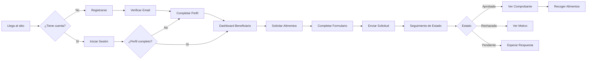

#### Pasos Detallados:

1. **Registro**
   - Accede a `/auth/registrar`
   - Ingresa email, contraseña y selecciona rol "Beneficiario"
   - Recibe email de verificación
   - Hace clic en el link de verificación

2. **Completar Perfil**
   - Redirigido a `/perfil/completar`
   - Ingresa datos personales (nombre, cédula, teléfono)
   - Valida cédula con API del gobierno ecuatoriano
   - Indica ubicación en el mapa (Mapbox)
   - Guarda perfil

3. **Solicitar Alimentos**
   - Navega a `/user/formulario`
   - Selecciona tipo de alimento del catálogo
   - Indica cantidad y unidad de medida
   - Agrega comentarios adicionales
   - Confirma ubicación de entrega
   - Envía solicitud

4. **Seguimiento**
   - Ve sus solicitudes en `/user/solicitudes`
   - Recibe notificaciones de cambios de estado
   - Puede ver detalles de cada solicitud
   - Descarga comprobante si fue aprobada

---

### 🎁 Usuario Donante

```mermaid
graph LR
    A[Iniciar Sesión] --> B[Dashboard Donante]
    B --> C[Nueva Donación]
    C --> D{Tipo de Persona}
    D -->|Jurídica| E[Ingresar RUC y datos empresa]
    D -->|Natural| F[Ingresar Cédula]
    E --> G[Validar con API]
    F --> G
    G --> H[Seleccionar Alimentos]
    H --> I{¿Producto en catálogo?}
    I -->|Sí| J[Seleccionar del catálogo]
    I -->|No| K[Producto personalizado]
    J --> L[Indicar cantidad y unidad]
    K --> L
    L --> M[Fecha de vencimiento]
    M --> N[Dirección de recogida]
    N --> O[Enviar Donación]
    O --> P[Seguimiento]
    P --> Q{Estado}
    Q -->|Pendiente| R[Esperar recogida]
    Q -->|Recogida| S[En tránsito]
    Q -->|Entregada| T[Ver Impacto]
```

#### Pasos Detallados:

1. **Crear Donación**
   - Navega a `/donante/nueva-donacion`
   - Completa formulario de donante (auto-llena desde perfil)
   - Valida RUC o cédula con la API
   - Selecciona alimentos a donar

2. **Configurar Donación**
   - Selecciona alimento del catálogo o crea personalizado
   - Indica cantidad y unidad de medida
   - Establece fecha de vencimiento
   - Indica fecha disponible para recogida
   - Proporciona dirección de entrega
   - Agrega observaciones

3. **Impacto Social**
   - El sistema calcula automáticamente:
     - Personas alimentadas estimadas
     - Equivalente en comidas
   - Ve estadísticas en su dashboard

---

### 🔧 Usuario Operador

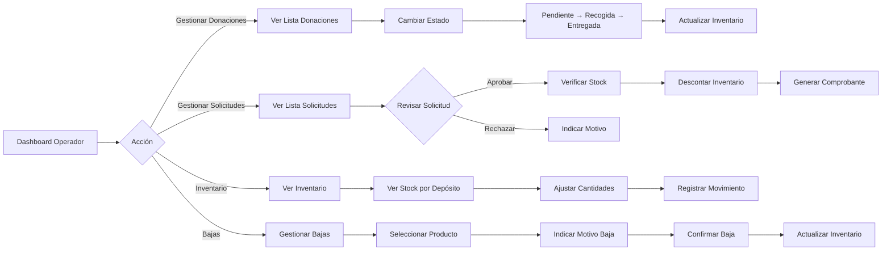

#### Flujos Principales:

1. **Gestión de Donaciones**
   - Ve donaciones pendientes en `/operador/donaciones`
   - Marca donación como "Recogida"
   - Coordina logística de recogida
   - Marca como "Entregada" cuando llega al depósito
   - El trigger crea una entrada independiente en `entradas_inventario`

2. **Aprobación de Solicitudes**
   - Ve solicitudes pendientes en `/operador/solicitudes`
   - Revisa detalles de la solicitud
   - Verifica disponibilidad sumando entradas compatibles
   - Aprueba o rechaza con motivo
   - La RPC descuenta entradas con FEFO y devuelve sus `id_entrada`
   - Se genera comprobante con código único

3. **Control de Inventario**
   - Ve stock en tiempo real por depósito
   - Puede ajustar cantidades manualmente
   - Registra bajas de productos (vencidos, dañados)
   - Todos los movimientos conservan `id_entrada` para trazabilidad

---

### 👨‍💼 Usuario Administrador

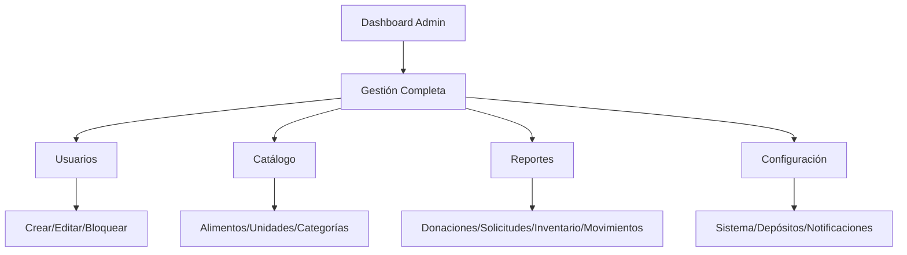

El administrador tiene acceso completo a todas las funcionalidades del sistema.

---

## Flujo Técnico (Request Lifecycle)

Este diagrama muestra el ciclo de vida completo de una petición HTTP en el sistema.

### 🔄 Ciclo de Vida de una Request

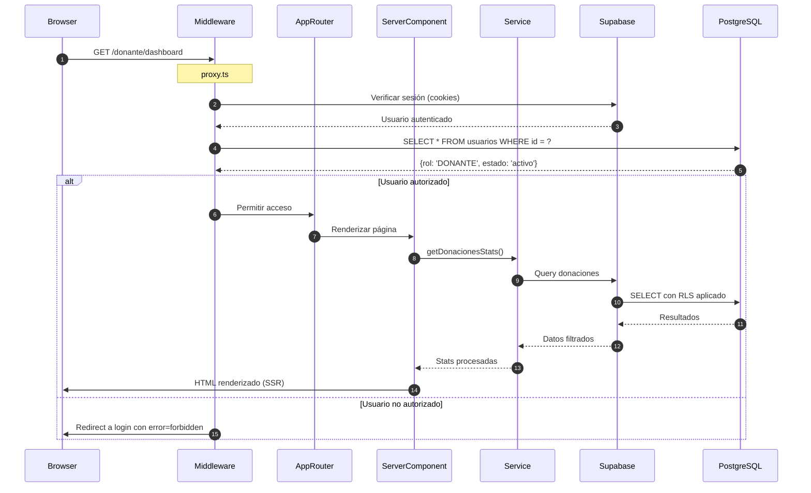

### Desglose de Capas:

#### 1. **Middleware Layer** (`proxy.ts`)

**Responsabilidad**: Autenticación, autorización y enrutamiento

```typescript
// Flujo en proxy.ts
export async function proxy(request: NextRequest) {
  // 1. Crear cliente Supabase con cookies
  const supabase = await createServerSupabaseClient();

  // 2. Verificar sesión
  const { data: { user } } = await supabase.auth.getUser();

  // 3. Regla especial para completar perfil
  if (isCompletarPerfilPath(pathname)) {
    return handleProfileCompletionRoute(request, supabase, user);
  }

  // 4. Validar ruta pública con match exacto o por segmento
  if (isAnyRouteMatch(pathname, RUTAS_PUBLICAS)) {
    return NextResponse.next();
  }

  // 5. Identificar rutas privadas compartidas o por rol
  const roleAccess = getRoleAccessForPath(pathname);
  const isPrivatePage =
    pathname === '/dashboard' ||
    isAnyRouteMatch(pathname, SHARED_PRIVATE_ROUTES) ||
    roleAccess;

  if (!isPrivatePage) {
    return NextResponse.next();
  }

  // 6. Rutas privadas: sesión, usuario activo, perfil completo y rol si aplica
  return protectPrivateRoute(request, supabase, user, roleAccess?.role);
}
```

**Mapa de rutas protegidas por `proxy.ts`:**

```typescript
const SHARED_PRIVATE_ROUTES = [
  '/perfil/actualizar',
  '/notificaciones',
  '/configuracion-notificaciones',
  '/comprobante',
];

const ROLE_PROTECTED_ROUTES = [
  { route: '/admin', role: 'ADMINISTRADOR' },
  { route: '/operador', role: 'OPERADOR' },
  { route: '/donante', role: 'DONANTE' },
  { route: '/user', role: 'SOLICITANTE' },
];
```

**Reglas de redirección:**

- Sin sesión en ruta privada: `/auth/iniciar-sesion?error=unauthorized&callbackUrl=...`.
- Perfil incompleto: `/perfil/completar`.
- Perfil completo intentando `/perfil/completar`: dashboard según rol.
- Usuario `bloqueado` o `desactivado`: cierre de sesión y login con error.
- Rol incorrecto en prefijo por rol: login con `error=forbidden`.

**Puntos clave**:
- Se ejecuta ANTES de cualquier página o API route no estática
- Tiene acceso a cookies de sesión
- Puede leer y modificar la request/response
- Realiza queries a la base de datos para validar roles
- Las API routes sensibles no dependen solo del proxy; validan sesión, perfil activo y rol dentro del handler

---

#### 2. **App Router Layer** (Next.js)

**Responsabilidad**: Enrutamiento y renderizado

```typescript
// src/app/donante/dashboard/page.tsx
export default async function DonanteDashboard() {
  // Server Component - se ejecuta en el servidor
  
  // 1. Obtener sesión (ya validada por middleware)
  const supabase = await createServerSupabaseClient();
  const { data: { user } } = await supabase.auth.getUser();
  
  // 2. Llamar al servicio de negocio
  const stats = await donacionService.getStats(user!.id);
  
  // 3. Renderizar componentes
  return (
    <DashboardLayout>
      <StatsCards data={stats} />
      <DonacionesRecientes userId={user!.id} />
    </DashboardLayout>
  );
}
```

**Características**:
- **Capacidad de Server Components**: Next.js permite renderizado en servidor para páginas de lectura
- **Estado actual**: 35 de 43 páginas del proyecto usan `'use client'`
- **Acceso a servicios**: Las páginas cliente consumen hooks, servicios y API routes; las páginas servidor pueden usar clientes server-side
- **Patrón aplicado**: Perfil y configuración común usan wrappers Server Component con islas cliente para carga/interacción
- **Oportunidad de mejora**: Migrar dashboards y vistas de solo lectura restantes a Server Components para aprovechar caching, streaming y menor JavaScript en cliente

---

#### 3. **Service Layer** (Lógica de Negocio)

**Responsabilidad**: Implementar reglas de negocio

```typescript
// src/modules/donante/donaciones/services/donacionService.ts
export class DonacionService {
  async crear(donacion: DonacionInput, userId: string) {
    // 1. Validar datos
    const validacion = validarDonacion(donacion);
    if (!validacion.success) {
      throw new Error('Datos inválidos');
    }
    
    // 2. Calcular impacto
    const impacto = calcularImpacto(
      donacion.cantidad,
      donacion.tipo_producto
    );
    
    // 3. Crear en base de datos
    const { data, error } = await this.supabase
      .from('donaciones')
      .insert({
        ...donacion,
        user_id: userId,
        impacto_estimado_personas: impacto.personas,
        impacto_equivalente: impacto.equivalente,
        estado: 'Pendiente'
      })
      .select()
      .single();
    
    if (error) throw error;
    
    // 4. Crear notificación para operadores
    await notificationService.crear({
      titulo: 'Nueva donación recibida',
      mensaje: `${donacion.tipo_producto} - ${donacion.cantidad}`,
      tipo: 'info',
      rol_destinatario: 'OPERADOR',
      categoria: 'donaciones',
      url_accion: `/operador/donaciones/${data.id}`
    });
    
    return { success: true, data };
  }
}
```

**Características**:
- **Encapsulamiento**: Toda la lógica de negocio en un lugar
- **Reutilizable**: Se usa desde páginas, API routes, y otros servicios
- **Testabilidad incremental**: Solicitudes ya separa casos de uso y servicios internos con tests sobre mocks de Supabase/inventario/movimientos
- **Type-safe**: TypeScript garantiza tipos correctos

---

#### 4. **Data Access Layer** (Supabase)

**Responsabilidad**: Interactuar con la base de datos

```typescript
// El servicio usa el cliente Supabase
const { data, error } = await supabase
  .from('donaciones')
  .insert(donacion)
  .select()
  .single();

// Supabase automáticamente:
// 1. Aplica Row Level Security (RLS)
// 2. Valida permisos según políticas
// 3. Ejecuta el query en PostgreSQL
// 4. Retorna datos filtrados
```

**Row Level Security (RLS) en acción**:
```sql
-- Política en PostgreSQL
CREATE POLICY "donante_select_own_donaciones" ON donaciones
  FOR SELECT USING (auth.uid() = user_id);

-- Cuando el donante hace query:
SELECT * FROM donaciones;  
-- PostgreSQL automáticamente agrega:
-- WHERE auth.uid() = user_id

-- El donante SOLO ve sus propias donaciones
```

---

## El Rol de proxy.ts

### 🛡️ Middleware de Autenticación y Autorización

El archivo `proxy.ts` es un **Middleware de Next.js** que intercepta las peticiones no estáticas antes de que lleguen a su destino.

#### ¿Por qué se llama "proxy"?

El nombre puede ser confuso, pero hace referencia a que actúa como un **intermediario** entre el cliente y las páginas/API routes. No es un proxy inverso tradicional, sino un **middleware de autenticación**.

#### Funciones Principales:

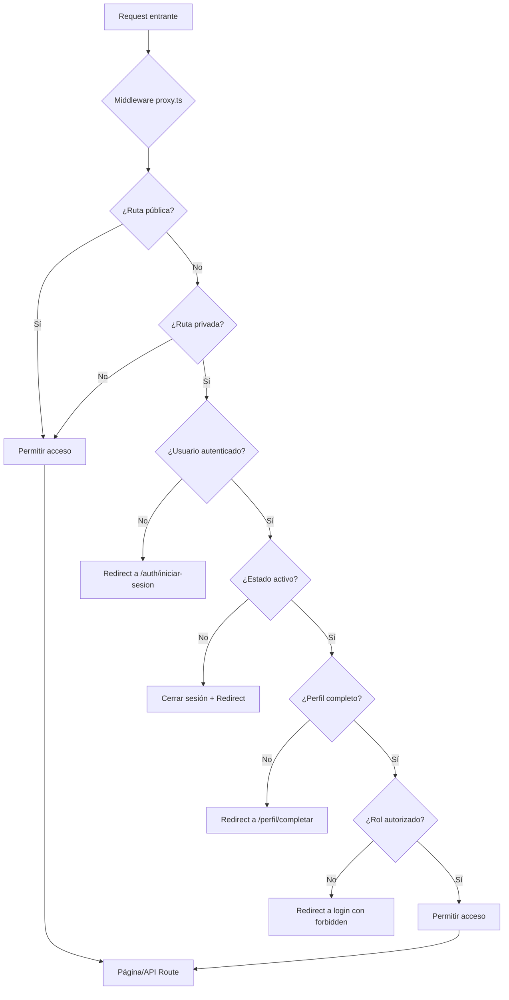

#### Código Explicado:

```typescript
// src/proxy.ts
import { createServerSupabaseClient } from '@/lib/supabase-server';
import { RUTAS_PUBLICAS } from '@/lib/constantes';
import { NextResponse, type NextRequest } from 'next/server';

export async function proxy(request: NextRequest) {
  // 1. Crear respuesta que incluye cookies de Supabase
  const supabaseResponse = NextResponse.next({ request });

  try {
    // 2. Crear cliente Supabase con acceso a cookies
    const supabase = await createServerSupabaseClient();

    // 3. Obtener usuario de la sesión
    const { data: { user }, error } = await supabase.auth.getUser();
    const isAuthenticated = !!(user && !error);

    const { pathname } = request.nextUrl;

    // 4. Si el usuario está logueado y trata de ir a login/register
    if ((pathname === '/auth/iniciar-sesion' || pathname === '/auth/registrar') 
        && isAuthenticated && user) {
      // Obtener perfil para redirigir al dashboard correcto
      const { data: perfil } = await supabase
        .from('usuarios')
        .select('estado, rol')
        .eq('id', user.id)
        .single();

      if (perfil) {
        // Validar estado
        if (perfil.estado === 'bloqueado' || perfil.estado === 'desactivado') {
          await supabase.auth.signOut();
          return supabaseResponse;
        }

        // Redirigir al dashboard según el rol
        const dashboardMap = {
          'ADMINISTRADOR': '/admin/dashboard',
          'OPERADOR': '/operador/dashboard',
          'DONANTE': '/donante/dashboard',
          'SOLICITANTE': '/user/dashboard'
        };
        
        return NextResponse.redirect(
          new URL(dashboardMap[perfil.rol] || '/user/dashboard', request.url)
        );
      }
    }

    // 5. Verificar si la ruta es pública
    if (isAnyRouteMatch(pathname, RUTAS_PUBLICAS)) {
      return supabaseResponse;
    }

    // 6. Para rutas privadas, verificar sesión, perfil, estado y rol.
    const roleAccess = getRoleAccessForPath(pathname);
    if (pathname === '/dashboard' ||
        isAnyRouteMatch(pathname, SHARED_PRIVATE_ROUTES) ||
        roleAccess) {
      return protectPrivateRoute(request, supabase, user, roleAccess?.role);
    }

    return supabaseResponse;
  } catch (error) {
    console.error('Error inesperado en middleware:', error);
    // Las rutas protegidas fallan cerradas y redirigen a login.
    return supabaseResponse;
  }
}

// 9. Configurar qué rutas intercepta el middleware
export const config = {
  matcher: [
    /*
     * Coincide con todas las rutas EXCEPTO:
     * - _next/static (archivos estáticos)
     * - _next/image (optimización de imágenes)
     * - favicon.ico
     * - archivos de imagen (.svg, .png, .jpg, etc.)
     */
    '/((?!_next/static|_next/image|favicon.ico|.*\\.(?:svg|png|jpg|jpeg|gif|webp)$).*)',
  ],
};
```

#### Puntos Clave:

1. **Se ejecuta en las peticiones no estáticas** (excepto assets e imágenes)
2. **Tiene acceso a cookies** (donde Supabase guarda el token)
3. **Puede hacer queries a la BD** para obtener perfil del usuario
4. **Puede redirigir** antes de que la petición llegue a la página
5. **Centraliza la protección de páginas privadas** (no se repite en cada página)
6. **Falla cerrado en rutas privadas** si ocurre un error de validación del proxy

#### Rutas por Categoría

| Categoría | Rutas | Regla |
|-----------|-------|-------|
| Públicas | `/`, `/contribuyentes`, `/auth/iniciar-sesion`, `/auth/registrar`, `/auth/olvide-contrasena`, `/auth/restablecer-contrasena`, `/auth/verificar-email` | Sin sesión |
| Completar perfil | `/perfil/completar` | Sesión requerida; permite perfil incompleto |
| Compartidas privadas | `/perfil/actualizar`, `/notificaciones`, `/configuracion-notificaciones`, `/comprobante/*` | Sesión, perfil activo y perfil completo |
| Por rol | `/admin/*`, `/operador/*`, `/donante/*`, `/user/*` | Sesión, perfil activo, perfil completo y rol correspondiente |
| Dashboard genérico | `/dashboard` | Redirige al dashboard del rol |

Las rutas `/api/*` pasan por el matcher del proxy, pero las APIs sensibles validan autorización dentro del handler. No se debe asumir que el proxy reemplaza la autorización server-side de una API.

---

## Flujos de Negocio Principales

### 🔐 Flujo: Crear o Actualizar Usuarios desde Admin

`/api/admin/usuarios` usa `SUPABASE_SERVICE_ROLE_KEY`, por lo que valida autorización dentro del handler aunque la ruta de página ya esté protegida por `proxy.ts`.

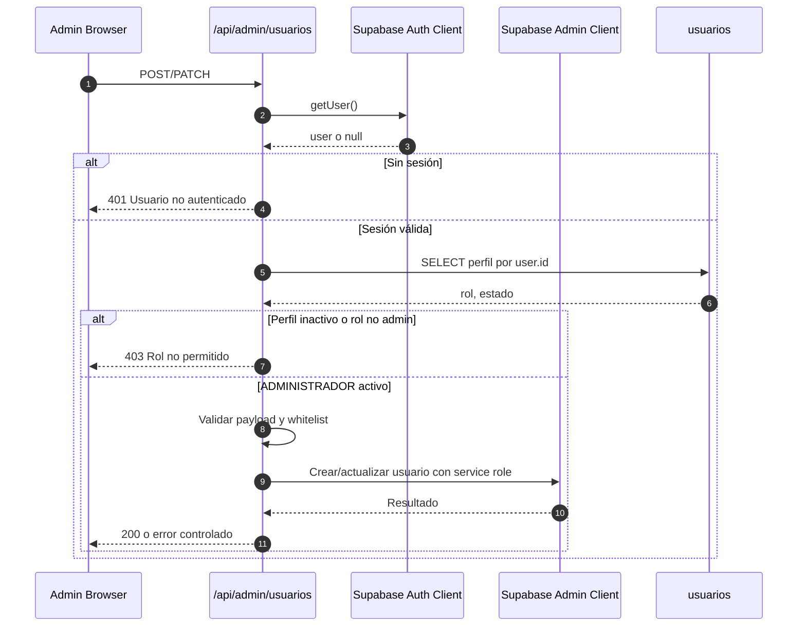

Reglas:

- `POST`: solo `ADMINISTRADOR` activo puede crear usuarios.
- `PATCH`: solo `ADMINISTRADOR` activo puede modificar usuarios.
- `PATCH` rechaza campos fuera de whitelist.
- `rol` solo acepta `ADMINISTRADOR`, `OPERADOR`, `DONANTE`, `SOLICITANTE`.
- `estado` solo acepta `activo`, `bloqueado`, `desactivado`.

### 🔒 Flujo: APIs Operativas Protegidas

Las APIs con datos operativos usan `requireActiveUserRole(supabase, roles)` para unificar sesión, perfil activo y rol permitido.

| API | Roles permitidos |
|-----|------------------|
| `/api/admin/cancelaciones-donaciones` | `ADMINISTRADOR` |
| `/api/operador/bajas` | `ADMINISTRADOR`, `OPERADOR` |
| `/api/operador/bajas/estadisticas` | `ADMINISTRADOR`, `OPERADOR` |
| `/api/operador/alertas-vencimiento` | `ADMINISTRADOR`, `OPERADOR` |
| `/api/comprobante/[codigo]` | Usuario activo; admin/operador o dueño del comprobante |
| `/api/proxy/consultar-cedula` | Usuario autenticado |
| `/api/proxy/consultar-ruc` | Usuario autenticado |

Las APIs de cédula/RUC no exigen perfil completo porque se usan durante el flujo de completar perfil. Sí exigen sesión para evitar uso anónimo del proxy externo.

### 🔔 Flujo: Crear Notificaciones Seguras

`/api/notificaciones` usa `SUPABASE_SERVICE_ROLE_KEY`, pero el cliente solo puede enviar eventos controlados:

```json
{
  "event": "catalog_food_request_created",
  "entityId": "55555555-5555-4555-8555-555555555555"
}
```

Reglas:

- La ruta valida sesión con el cliente normal de Supabase.
- La ruta valida perfil activo con el cliente admin.
- `notificationEventDispatcher` valida el rol permitido y el ownership/contexto de `entityId`.
- El servidor construye `titulo`, `mensaje`, destinatario, URL, metadata y email.
- La ruta rechaza campos sensibles enviados desde cliente, como `destinatarioId`, `rolDestinatario`, `email`, `titulo` o `mensaje`.

Eventos permitidos:

| Evento | Roles que pueden dispararlo | Destinatario |
|--------|-----------------------------|--------------|
| `catalog_food_request_created` | `DONANTE` | `ADMINISTRADOR` |
| `catalog_food_request_reviewed` | `ADMINISTRADOR` | Donante dueño de la solicitud |
| `food_request_status_changed` | `ADMINISTRADOR`, `OPERADOR` | Solicitante dueño |
| `donation_status_changed` | `ADMINISTRADOR`, `OPERADOR` | Donante dueño |

### 📦 Flujo: Aprobar Solicitud con Inventario

La fachada `createSolicitudesActionService()` conserva la API pública usada por hooks y páginas, pero delega en casos de uso internos.

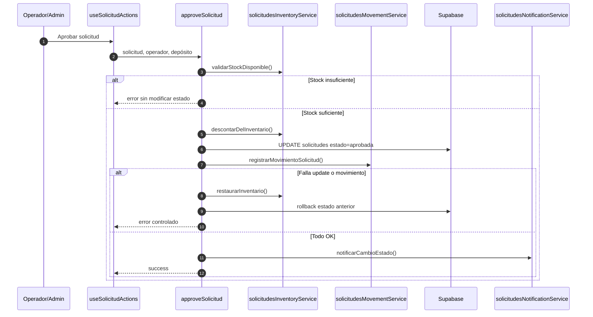

Este flujo evita que una solicitud quede aprobada sin descuento efectivo o sin movimiento esperado.

### 📦 Flujo Completo: Crear una Donación

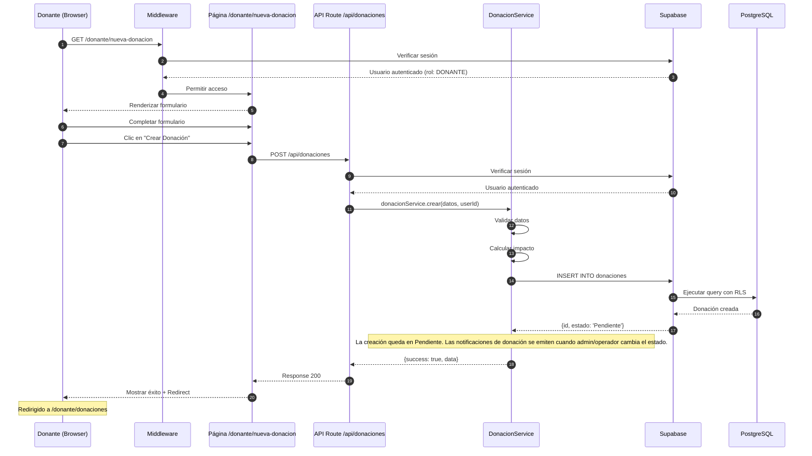

---

### ✅ Flujo Completo: Aprobar una Solicitud

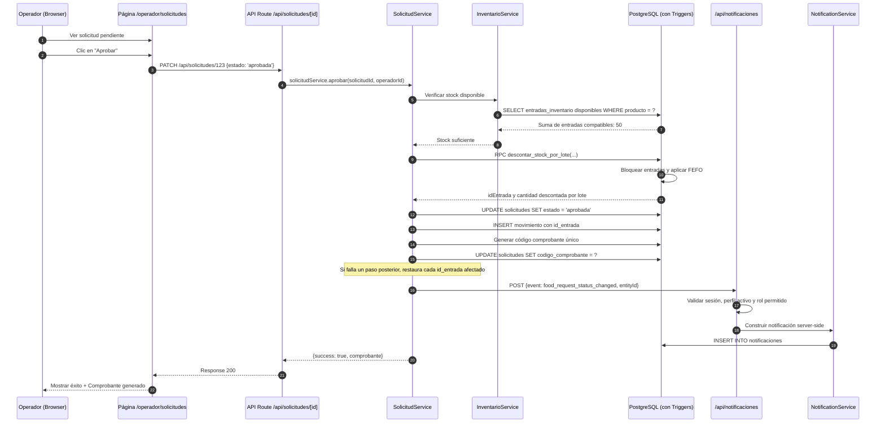

**Aspectos importantes:**
1. Todo ocurre en una **transacción** para garantizar consistencia
2. La RPC de inventario bloquea entradas y aplica FEFO
3. El stock se **descuenta directamente en entradas_inventario**
4. Se **genera un comprobante** con código único
5. Se envía **notificación** al beneficiario

---

### 📊 Flujo: Actualizar Inventario desde Donación Aprobada

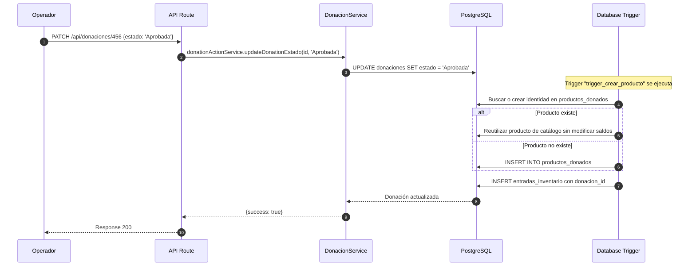

**Puntos clave:**
- El **trigger de PostgreSQL** hace todo el trabajo pesado
- **Previene duplicados** de entradas con `donacion_id`
- **Crea un lote independiente** aunque el producto de catálogo se repita
- **Garantiza consistencia** de datos

---

## Diagramas de Secuencia

### 🔐 Autenticación Completa

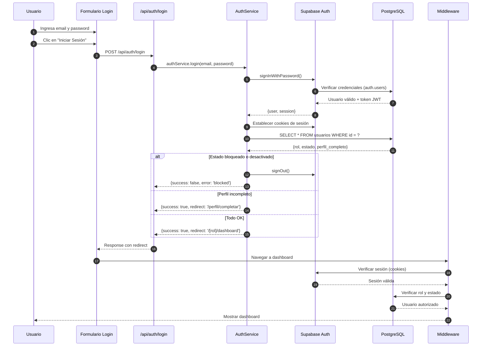

---

### 📧 Flujo de Notificaciones

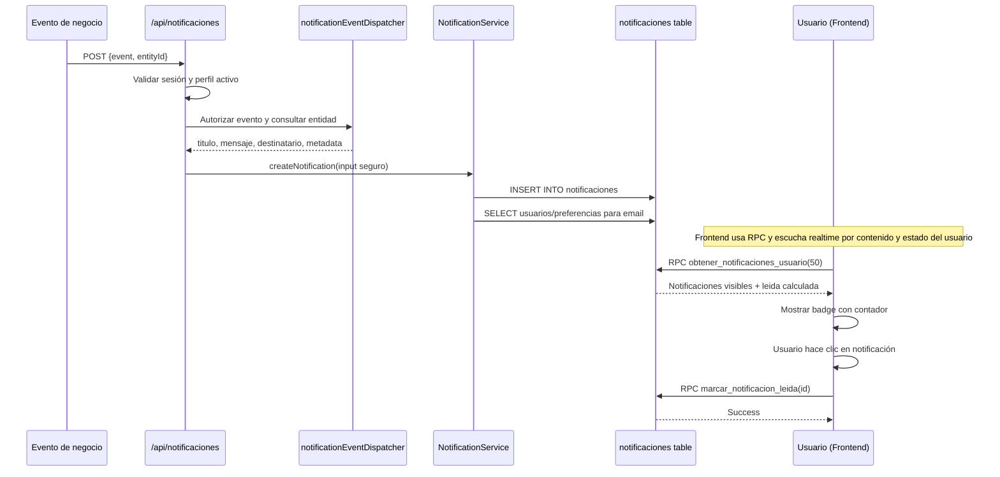

`/api/notificaciones` no acepta `titulo`, `mensaje`, `destinatarioId`, `rolDestinatario`, `email`, `metadatos` ni `urlAccion` desde el cliente. El contrato público es `{ event, entityId }`. El hook de notificaciones carga mediante `obtener_notificaciones_usuario(50)`, que aplica la visibilidad y combina el estado desde `notificaciones_usuario`. Realtime escucha tres filtros de `notificaciones` (`destinatario_id`, rol y `TODOS`) y un filtro de `notificaciones_usuario` por `usuario_id`; el handler deduplica por `id` y actualiza el contador individual.

---

## Conclusión

### Resumen de Flujos Clave:

1. **Middleware (proxy.ts)** es la primera línea de defensa
   - Valida autenticación en TODAS las peticiones
   - Redirige según rol y estado
   - Centraliza la lógica de seguridad

2. **Services** encapsulan la lógica de negocio
   - Se reutilizan desde páginas y API routes
   - Implementan reglas de negocio complejas
   - Coordinan operaciones entre entidades

3. **Database Triggers** automatizan operaciones
   - Crean entradas de inventario automáticamente para donaciones
   - Crean notificaciones en tiempo real
   - Garantizan integridad de datos

4. **Row Level Security (RLS)** filtra datos
   - Se aplica automáticamente en cada query
   - Los usuarios solo ven lo que les corresponde
   - Seguridad a nivel de base de datos

Esta arquitectura garantiza:
- ✅ **Seguridad** en múltiples capas
- ✅ **Consistencia** de datos con triggers/RPC y compensación explícita en solicitudes
- ✅ **Trazabilidad** de todas las operaciones
- ✅ **Escalabilidad** con lógica modular
- ✅ **Mantenibilidad** con código organizado
